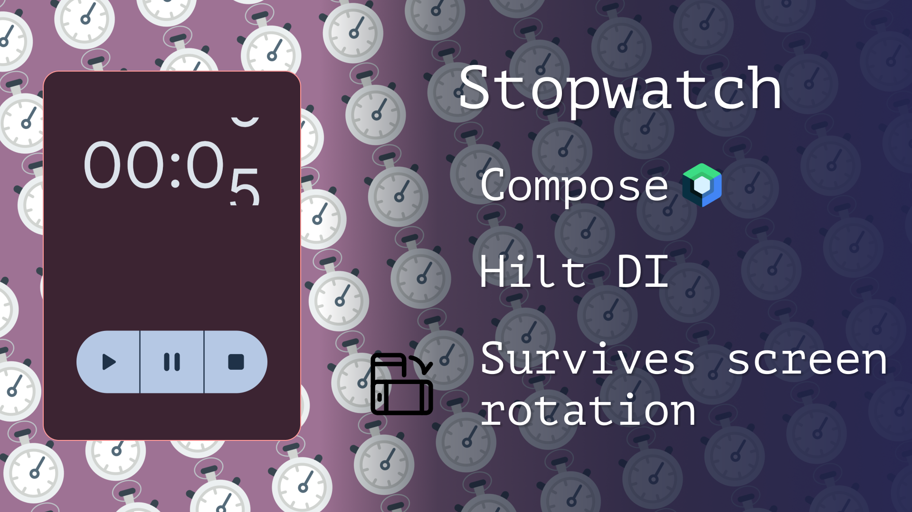
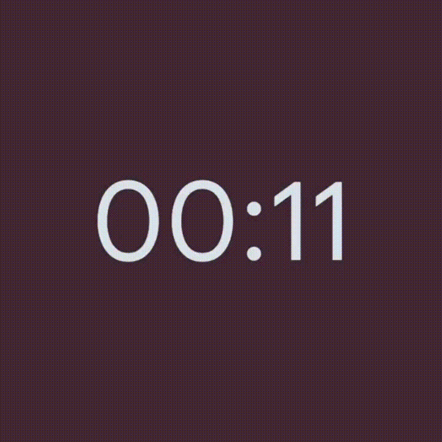
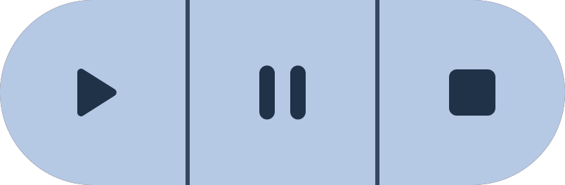

# Compose-StopWatch


StopWatch is a simple app, built with Jetpack Compose. The goal of the sample is to
showcase implementing DI and async programming with Coroutines. Also UI State survives Config Changes (screen rotation).





### What I used in this project:

- Jetpack Compose
- DI
- Coroutines

## Count animation based on a [`tutorial`](https://youtu.be/07ZdBCyh7sc)




### Half-rounded buttons 




``` kotlin
   
   StopwatchButton(
            modifier = Modifier
                .clip(
                    RoundedCornerShape(
                        topStartPercent = 100,
                        bottomStartPercent = 100
                    )
                ),
            icon = Icons.Rounded.PlayArrow
        )
   
```
